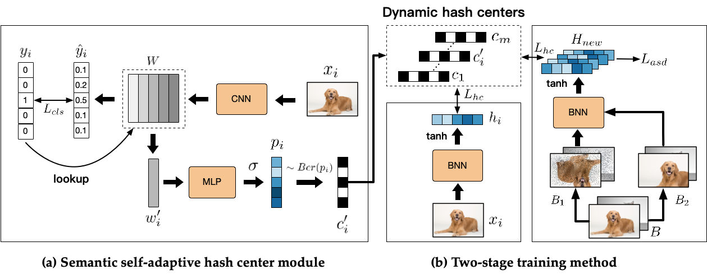

# ODH
This is the Python implementation of the paper One-bit Deep Hashing: Towards a Resource-Efficient Hashing Model with Binary Neural Networks (ACMMM24) (https://dl.acm.org/doi/abs/10.1145/3664647.3681496).

### Overview
This paper addresses the performance degradation of Binary Neural Networks (BNNs) in Deep Hashing (DH). Through experimental analysis, it first identifies the critical role of **center-based methods** in BNN-DH and unveils the unique challenges BNN-DH faces compared to CNN-DH in terms of hash code convergence and aggregation evolution. Building upon these insights, we propose a robust and versatile approach—**One-bit Deep Hashing (ODH)**—which incorporates a **semantic-adaptive hashing center module** to enhance hash code convergence and a **two-stage training strategy** to optimize the hash code aggregation process. Experimental results demonstrate that ODH significantly outperforms existing BNN-DH methods across multiple datasets.



### Main Dependencies
+ pytohn 3.8
+ torch 1.11.0+cu113
+ numpy 1.22.4
+ psutil 5.9.1
+ kornia 0.7.1
+ pandas 2.0.3

### How to run
You can easily run our code by following these steps: 

**Step one**:  
To train a **Semantic Self-adaptive Hash Center Module**, execute:  
```
sh scripts/run_center.sh
```  
By modifying the `dataset` parameter in `warm_up.py`, you can train the model on different datasets. The default dataset is **CIFAR-100**. Please note that the CIFAR100 dataset will be automatically downloaded when you run the code. For the **ImageNet100** dataset, you can simply download it using the provided links from other **deep hashing models**.

**Step two**: 
Train a **BNN-based deep hashing model** using the **Two-stage Training Method** by executing the following command:  
```
sh scripts/run.sh
```  
This will initiate the training process. Specify the **BNN model** by modifying the parameter `--bnn_model`, and select the **dataset** by adjusting the parameter `--dataset`.

### Citation
If you find our code useful and use ODH in your work, please cite our paper.
```bash
@inproceedings{he2024one,
  title={One-bit deep hashing: Towards resource-efficient hashing model with binary neural network},
  author={He, Liyang and Huang, Zhenya and Liu, Chenglong and Li, Rui and Wu, Runze and Liu, Qi and Chen, Enhong},
  booktitle={Proceedings of the 32nd ACM International Conference on Multimedia},
  pages={7162--7171},
  year={2024}
}
```
